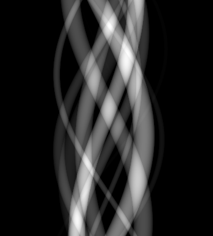
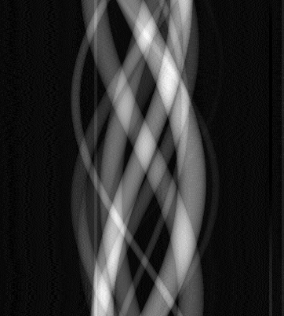
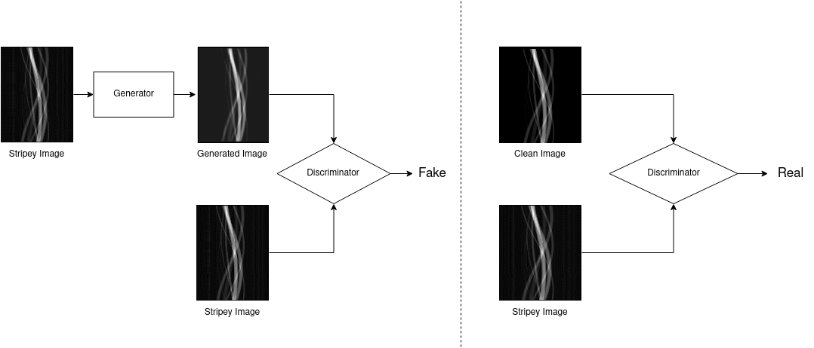
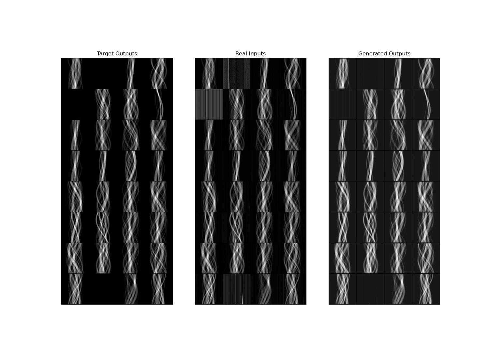
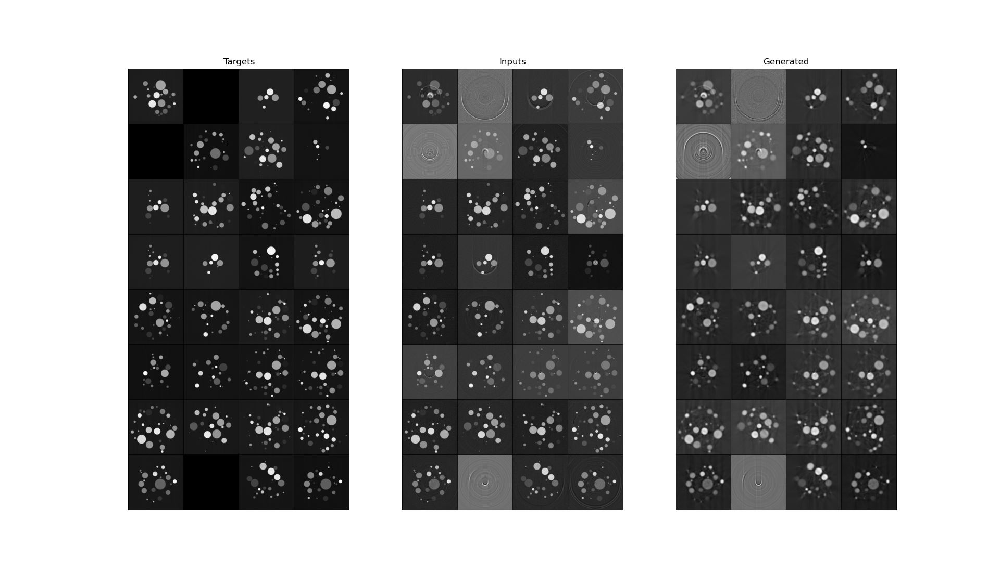
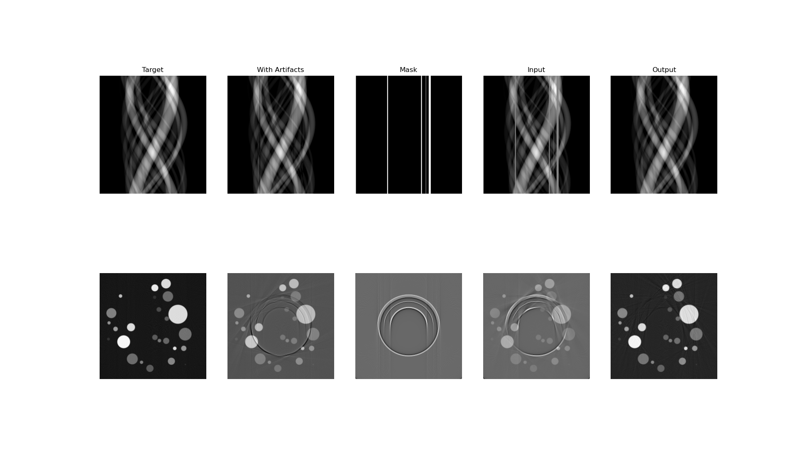
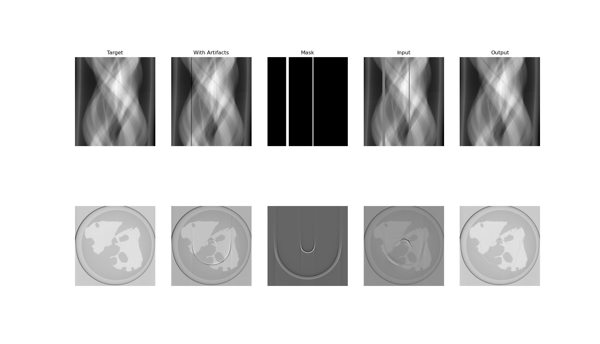
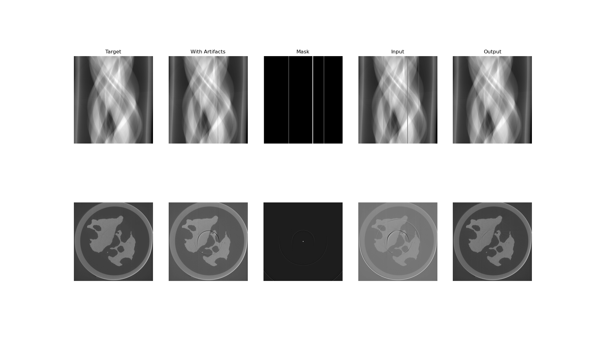

# No Stripes Net

A neural network to remove stripe artifacts in sinograms.<br>
The network takes a sinogram with stripes as input, and learns to remove those stripes from it.<br>
The network will train on both simulated and real-life data.<br>
<br>
In order to train successfully, the network needs a "clean" sinogram, i.e. one with no artifacts, to use as a reference "ground truth" image.<br>
However, such images are difficult to obtain in practice, and so the following solution is being used:<br>

- For each slice of a 3-dimensional sinogram, shift the sample in the vertical direction up and down by a small amount
- Collect scans at each of these shifts
- The detector stays stationary during these scans, so the artifacts caused by detector defects will have moved relative to the sample
- This means that each of the shifted scans collected will have a different distribution of artifacts, but the same underlying sample data
- The different shifts can then be analysed to detect the locations of stripes within them
- A "ground truth" clean image can be created by selecting individual clean windows from different shifts, and combining these into one sinogram<br>

### Data Generation

The simulated data is generated using the TomoPhantom [\[1\]](#references) Python package.<br>
First, a random 3D foam object is generated, as well as its projection data.<br>
Then, synthetic flat fields are simulated to add noise and artifacts to the sinogram.<br>
These flat fields are shifted up and down, to simulate the vertical movement of the phantom, giving a number of shifted scans, each with a different distribution of artifacts.<br>
Additionally, a "clean" image is generated with no artifacts whatsoever, to be used as a reference point.<br>
<br>
Script ```run_scripts/data_generator.sh``` should be executed to generate the synthetic data.<br>
Data is stored under the top-level ```data/``` directory, which is created during the execution of the script.<br>
Data has the following structure:
```
data
   ├── 0000
   │   ├── clean
   │       │   ├── 0000_clean_0000.tif
   │       │   ├── ... 
   │       │   ├── 0000_clean_0255.tif
   │   ├── shift00
   │       │   ├── 0000_shift00_0000.tif
   │       │   ├── ... 
   │       │   ├── 0000_shift00_0255.tif
   │   ├── shift01
   │       │   ├── 0000_shift01_0000.tif
   │       │   ├── ... 
   │       │   ├── 0000_shift01_0255.tif
   │   ├── ...
   ├── 0001
   │   ├── clean
   │       │   ├── ... 
   │   ├── shift00
   │       │   ├── ... 
   │   ├── shift01
   │       │   ├── ... 
   │   ├── ...
   ├── 0002
   │   ├── clean
   │   ├── shift00
   │   ├── shift01
   │   ├── ...
   ├── ...
```
Each 3D sample generated has a number associated with it; these are the first-level sub-directories (e.g. ```data/0000```)<br>
Within those sub-directories, there are further sub-directories to represent the "clean" sinogram and each shift.<br>
Within those sub-directories, each slice of the 3D sinogram is stored as a 2D TIFF image.<br>

Example of generated images:<br>
    
    

### Network Architecture

The network architecture is inspired by Generative Adversarial Networks (GANs) [\[2\]](#references) and U-Nets [\[3\]](#references).<br>
A conditional GAN [\[4\]](#references) is used with a U-Net as the generator, where both the generator and the discriminator are conditioned on the sinogram with artifacts.<br>
The discriminator first takes the generated images as input, then calculates its loss based on how accurate it was at detecting whether the inputs were fake or not. It then does the same thing for the real "ground truth" images.<br>
The generator takes the sinogram with stripes as input, and outputs the generated image.
It uses a joint loss function [\[5\]](#references), consisting of two parts:<br>

- It first calculates loss based on how *inaccurate* the discriminator was at predicting whether its generated images were real or not 
- It then calculates a second loss based on how "close" the generated images were to the real "ground truth" images<br>

 Network Architecture Diagram:<br>
    
    
    
## Current Progess

The network has been run a number of times and is performing reasonably.<br>
It has a general smoothing effect, reducing background noise and some stripes.<br>
However, this smoothing effect also results in the loss of some resolution in reconstructed images.<br>
Additionally, some new artifacts have been introduced, which can be seen in the centres of the images.
This is most likely due to the network currently being unable to distinguish between finer details of sinograms,
especially when the lines overlap.<br>
In order to improve its performance, the network may need to train for longer, or with more data.
Alternatively, some hyperparameters (such as the learning rate or betas for the Adam optimizer) may need tuning.<br>

The network has been trained on both individual windows, and whole sinograms.
Results of these can be seen below.<br>
Windows:<br>
    
    

The generated windows have borders on their edges, and so when combined together this creates new stripe artifacts,
causing rings in the reconstruction.<br>
This can be avoided using a few methods:<br>
- Enlargen the window width and overlap the windows slightly, so that the borders are overwritten
- Pad the windows when they are input to the network, so the network doesn't create borders
- Combine the windows before they are input, and train on whole sinograms<br>

Whole Sinograms:<br>
    
    

The window stripe artifacts are now gone; however, there is still a loss of resolution.<br>
Additionally, other types of artifacts can be seen around the details of the sample.<br>

In order to stop this loss of resolution a new method is being developed, inspired by that in [\[6\]](#references).<br>
Instead of generating the entire sinogram, we "mask" out the parts of the sinogram that contain stripes,
and train the network to only generate data in those parts of the image.<br>
This means that most of the sinogram data will stay the same - only the parts that contain stripes will be changed.
The hope is that this will increase the resolution.<br>

This new method requires an accurate way of detecting the location of stripes within a sinogram.<br>
The current method consists of three approaches, which are then all combined to form a mask.<br>
- The first approach is that of [\[7\]](#references), as implemented in the [TomoPy](https://github.com/tomopy/tomopy) package.<br>
- The second is the stripe detection method implemented in the [Larix](https://github.com/dkazanc/larix) package.<br>
- The third is inspired by that in [\[8\]](#references), and involves calculating the mean curve of an image, smoothing that curve,
calculating the difference between these two curves, then thresholding this difference.
Then, some simple convolutional smoothing is applied to this mask, followed by a check to constrain the widths of each
positive (i.e. ones) section of the mask.<br>

These three separate masks are combined by summing them all together,
and a final mask is formed by the sections of this sum whose value is greater than 2.<br>
In other words, two or more approaches have to agree on the location of a stripe for it to be included in the final mask.
<br>

This new method involving masks is effective; it successfully stops the loss of resolution from occuring.<br>
However, some new artifacts are still introduced.
    

It was not immediately clear why the network was still introducing new artifacts.<br>
One possibility is that all the noise and other background information in the simulated images was confusing the network,
affecting its ability to successfully inpaint.<br>
So, it was decided to train the network with a more *simple* set of data; images that did not contain any noise.<br>
The results of this can be seen below:
    
It is clear the simpler dataset leads to much better performance, reinforcing the theory that noise is complicating
the network's outcomes.<br>

The challenge after this was to get similar results on the noisy data.<br>
This proved more difficult than originally thought, and no major progress or breakthroughs have since been achieved.<br>
Therefore, it was decided to temporarily stop working on the simulated data and instead move onto the real-life data.<br>

The first challenge in using the real data was getting it into the right format for the network.<br>
The original plan was to get the data directly from HDF files then pass them straight into the network as NumPy arrays.<br>
However, it took around 20 seconds to load one 2D slice of a sample - although this may not sound like much, it quickly adds up:<br>
 - There are 20 vertical shifts of the sample, and all are needed to calculate the input/target pair.
 - With a batch size of 16, this gives 20s * 20 * 16 = 6400s or 1.78 hours per batch.

Considering there may be hundreds of batches per training epoch, it quickly became clear that this was not a viable or efficient option.<br>

The other option was to pre-process the real data and save the input/target pair as a series of 2D Tiff images 
(in the same manner as the simulated data).<br>
I was initially reluctant to do this due to storage constraints, however now it was clear this was the only option.<br>
Saving the data in this way meant it could be sped up; 
 - As the 2D slices did not have to be selected randomly anymore, multiple slices could be selected at once to get a 3D image (still a subset of the entire 3D sample).<br>
 - Then, the 20 shifts could be loaded for this 3D image, rather than for each individual 2D slice.<br>
 - It was found experimentally that the optimum number of slices to load at one time was 243.
   - with a total number of slices of 2160, this meant 9 total loads
 - Each load (of 243 slices) took around 60s, and so total load time was 60s * 20 shifts * 9 loads = 10800s or 3 hours.<br>
 
While this time is larger than the previous, it is worth remembering that this is for the **entire sample**, not just one batch of 16 images.<br>
Another advantage of saving the data in this way is that it is in the same format as the simulated data;
no extra pre-processing is required to train a neural network on the real-life data.<br>

So now that the real-life data was in the right format, it was time to train a model on it.<br>
The first model was trained on full (non-masked) sinograms, and generated full (non-masked) sinograms.<br>
It showed promising results; unlike previous models it was able to remove the stripe artifacts from the inputs.<br>
However, like previous models that trained on full sinograms, it suffered from blurry and low-resolution outputs.<br>

Subsequent models were trained using the masking approach as previously described.<br>
These models had less blurry results, but like other similar models they didn't entirely get rid of the artifacts,
and sometimes introduced entirely new artifacts.
    
    
In a similar fashion to before, it was decided to create a "simple" real-life dataset.<br>
The clean images (targets) were still created in the same way; however, instead of using inputs from the real dataset,<br>
we created an input image by manually adding in stripes using [TomoPhantom](#references).<br>
Using this method meant that the **only** difference between inputs and targets was the artifacts; the network didn't
have any noise to interfere with its inpainting.
    

## References

[1] [D. Kazantsev et al. 2018, TomoPhantom, a software package to generate 2D-4D analytical phantoms for CT image reconstruction algorithm benchmarks, Software X, Volume 7, January–June 2018, Pages 150–155](https://doi.org/10.1016/j.softx.2018.05.003)
<br><br>
[2] [I. Goodfellow et al. 2014, Generative Adversarial Nets, Advances in Neural Information Processing Systems (NIPS 2014), pp. 2672-2680](https://doi.org/10.48550/arXiv.1406.2661)
<br><br>
[3] [Ronneberger, O., Fischer, P. and Brox, T., 2015, October. U-net: Convolutional networks for biomedical image segmentation. In International Conference on Medical image computing and computer-assisted intervention (pp. 234-241). Springer, Cham.](https://doi.org/10.48550/arXiv.1505.04597)
<br><br>
[4] [Mirza, M. and Osindero, S., 2014. Conditional generative adversarial nets. arXiv preprint arXiv:1411.1784](https://doi.org/10.48550/arXiv.1411.1784)
<br><br>
[5] [Isola, P., Zhu, J.Y., Zhou, T. and Efros, A.A., 2017. Image-to-image translation with conditional adversarial networks. In Proceedings of the IEEE conference on computer vision and pattern recognition (pp. 1125-1134).](https://doi.org/10.48550/arXiv.1611.07004)
<br><br>
[6] [Ghani, M.U. and Karl, W.C., 2019. Fast enhanced CT metal artifact reduction using data domain deep learning. IEEE Transactions on Computational Imaging, 6, pp.181-193.](https://doi.org/10.48550/arXiv.1904.04691)
<br><br>
[7] [Vo, N.T., Atwood, R.C. and Drakopoulos, M., 2018. Superior techniques for eliminating ring artifacts in X-ray micro-tomography. Optics express, 26(22), pp.28396-28412.](https://doi.org/10.1364/OE.26.028396)
<br><br>
[8] [Ashrafuzzaman, A.N.M., Lee, S.Y. and Hasan, M.K., 2011. A self-adaptive approach for the detection and correction of stripes in the sinogram: suppression of ring artifacts in CT imaging. EURASIP Journal on Advances in Signal Processing, 2011, pp.1-13.](https://doi.org/10.1155/2011/183547)