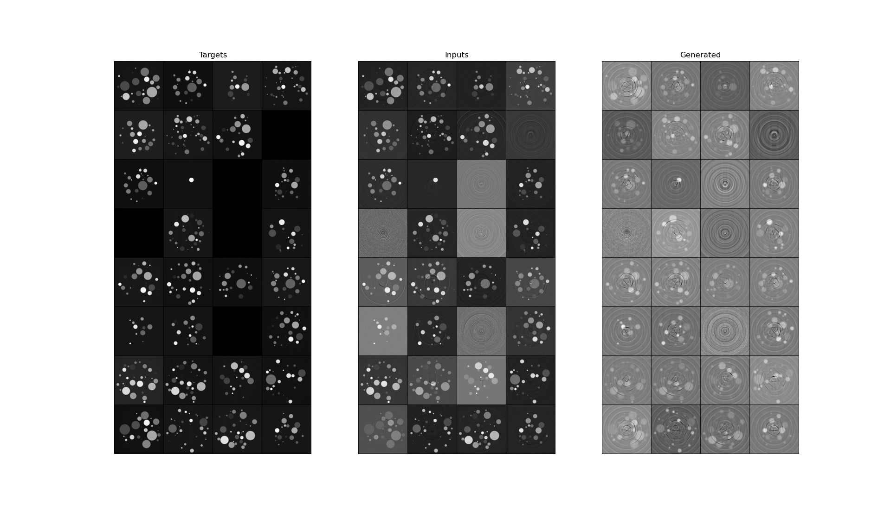

# No Stripes Net

A neural network to remove stripe artifacts in sinograms.<br>
The network takes a sinogram with stripes as input, and learns to remove those stripes from it.<br>
The network will train on both simulated and real-life data.<br>
<br>
In order to train successfully, the network needs a "clean" sinogram, i.e. one with no artifacts, to use as a reference "ground truth" image.<br>
However, such images are difficult to obtain in practice, and so the following solution is being used:<br>

- For each slice of a 3-dimensional sinogram, shift the sample in the vertical direction up and down by a small amount
- Collect scans at each of these shifts
- The detector stays stationary during these scans, so the artifacts caused by detector defects will have moved relative to the sample
- This means that each of the shifted scans collected will have a different distribution of artifacts, but the same underlying sample data
- The different shifts can then be analysed to detect the locations of stripes within them
- A "ground truth" clean image can be created by selecting individual clean windows from different shifts, and combining these into one sinogram<br>

### Data Generation

The simulated data is generated using the TomoPhantom [\[1\]](#references) Python package.<br>
First, a random 3D foam object is generated, as well as its projection data.<br>
Then, synthetic flat fields are simulated to add noise and artifacts to the sinogram.<br>
These flat fields are shifted up and down, to simulate the vertical movement of the phantom, giving a number of shifted scans, each with a different distribution of artifacts.<br>
Additionally, a "clean" image is generated with no artifacts whatsoever, to be used as a reference point.<br>
<br>
Script ```run_scripts/data_generator.sh``` should be executed to generate the synthetic data.<br>
Data is stored under the top-level ```data/``` directory, which is created during the execution of the script.<br>
Data has the following structure:
```
data
   ├── 0000
   │   ├── clean
   │       │   ├── 0000_clean_0000.tif
   │       │   ├── ... 
   │       │   ├── 0000_clean_0255.tif
   │   ├── shift00
   │       │   ├── 0000_shift00_0000.tif
   │       │   ├── ... 
   │       │   ├── 0000_shift00_0255.tif
   │   ├── shift01
   │       │   ├── 0000_shift01_0000.tif
   │       │   ├── ... 
   │       │   ├── 0000_shift01_0255.tif
   │   ├── ...
   ├── 0001
   │   ├── clean
   │       │   ├── ... 
   │   ├── shift00
   │       │   ├── ... 
   │   ├── shift01
   │       │   ├── ... 
   │   ├── ...
   ├── 0002
   │   ├── clean
   │   ├── shift00
   │   ├── shift01
   │   ├── ...
   ├── ...
```
Each 3D sample generated has a number associated with it; these are the first-level sub-directories (e.g. ```data/0000```)<br>
Within those sub-directories, there are further sub-directories to represent the "clean" sinogram and each shift.<br>
Within those sub-directories, each slice of the 3D sinogram is stored as a 2D TIFF image.<br>

Example of generated images:<br>
    
    

### Network Architecture

The network architecture is inspired by Generative Adversarial Networks (GANs) [\[2\]](#references) and U-Nets [\[3\]](#references).<br>
A conditional GAN [\[4\]](#references) is used with a U-Net as the generator, where both the generator and the discriminator are conditioned on the sinogram with artifacts.<br>
The discriminator first takes the generated images as input, then calculates its loss based on how accurate it was at detecting whether the inputs were fake or not. It then does the same thing for the real "ground truth" images.<br>
The generator takes the sinogram with stripes as input, and outputs the generated image.
It uses a joint loss function [\[5\]](#references), consisting of two parts:<br>

- It first calculates loss based on how *inaccurate* the discriminator was at predicting whether its generated images were real or not 
- It then calculates a second loss based on how "close" the generated images were to the real "ground truth" images<br>

 Network Architecture Diagram:<br>
    
    
    
## Current Progess

The network has been run a number of times and is performing reasonably.<br>
It has a general smoothing effect, reducing background noise and some stripes.<br>
However, this smoothing effect also results in the loss of some resolution in reconstructed images.<br>
Additionally, some new artifacts have been introduced, which can be seen in the centres of the images.
This is most likely due to the network currently being unable to distinguish between finer details of sinograms,
especially when the lines overlap.<br>
In order to improve its performance, the network may need to train for longer, or with more data.
Alternatively, some hyperparameters (such as the learning rate or betas for the Adam optimizer) may need tuning.<br>

The network has been trained on both individual windows, and whole sinograms.
Results of these can be seen below.<br>
Windows:<br>
    
    

The generated windows have borders on their edges, and so when combined together this creates new stripe artifacts,
causing rings in the reconstruction.<br>
This can be avoided using a few methods:<br>
- Enlargen the window width and overlap the windows slightly, so that the borders are overwritten
- Pad the windows when they are input to the network, so the network doesn't create borders
- Combine the windows before they are input, and train on whole sinograms<br>

Whole Sinograms:<br>
    
    

The window stripe artifacts are now gone; however, there is still a loss of resolution.<br>
Additionally, other types of artifacts can be seen around the details of the sample.<br>

More experimentation is being done to reduce these artifacts and increase the resolution.


## References

[1] [D. Kazantsev et al. 2018, TomoPhantom, a software package to generate 2D-4D analytical phantoms for CT image reconstruction algorithm benchmarks, Software X, Volume 7, January–June 2018, Pages 150–155](https://doi.org/10.1016/j.softx.2018.05.003)
<br><br>
[2] [I. Goodfellow et al. 2014, Generative Adversarial Nets, Advances in Neural Information Processing Systems (NIPS 2014), pp. 2672-2680](https://doi.org/10.48550/arXiv.1406.2661)
<br><br>
[3] [Ronneberger, O., Fischer, P. and Brox, T., 2015, October. U-net: Convolutional networks for biomedical image segmentation. In International Conference on Medical image computing and computer-assisted intervention (pp. 234-241). Springer, Cham.](https://doi.org/10.48550/arXiv.1505.04597)
<br><br>
[4] [Mirza, M. and Osindero, S., 2014. Conditional generative adversarial nets. arXiv preprint arXiv:1411.1784](https://doi.org/10.48550/arXiv.1411.1784)
<br><br>
[5] [Isola, P., Zhu, J.Y., Zhou, T. and Efros, A.A., 2017. Image-to-image translation with conditional adversarial networks. In Proceedings of the IEEE conference on computer vision and pattern recognition (pp. 1125-1134).](https://doi.org/10.48550/arXiv.1611.07004)