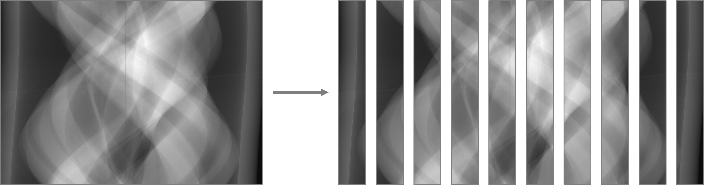
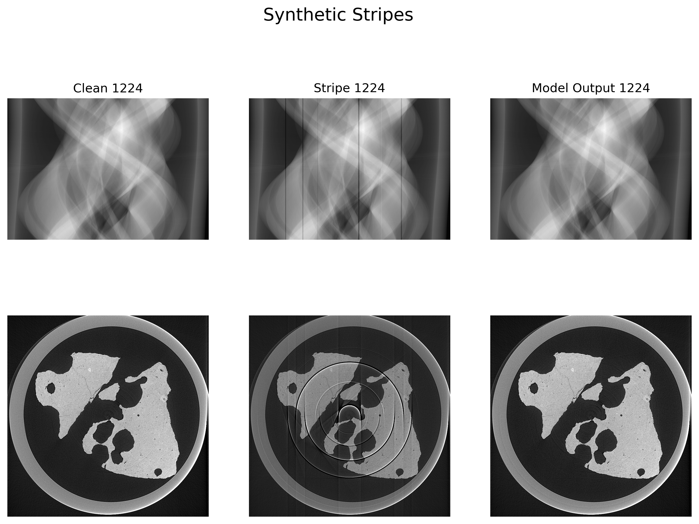

# NoStripesNet Tutorial
The NoStripesNet repository can be used to create new models and datasets, visualise the results of trained models, and remove ring artifacts from arbitrary samples.<br>
In this tutorial, all of these areas will be explained with practical and visual examples.<br>

### Contents
- [Prerequisites](#prerequisites)
- [Introduction](#introduction)
- [Step 1 - Generating a Mask](#step-1---generating-a-mask)
- [Step 2 - Generating a Dataset](#step-2---generating-a-dataset)
- [Step 3 - Training a Model](#step-3---training-a-model)
- [Step 4 - Testing a Model](#step-4---testing-a-model)
- [Step 5 - Visualising the Results](#step-5---visualising-the-results)
- [Step 6 - Applying the Model](#step-6---applying-the-model)
  - [Applying in a Notebook](#applying-in-a-notebook)
  - [Applying Directly](#applying-directly)

### Prerequisites
Before starting this tutorial, you should have cloned the repository and created a conda environment for the project. This can be done using the steps below:<br>
  - Clone the repository: `git clone https://github.com/dkazanc/NoStripesNet.git`
  - Create the conda environment: `conda env create -f environment.yml`
  - Activate the conda environment: `conda activate nostripesnet`
  
### Introduction
To begin with, let's imagine we have just performed a tomograpghic scan and we wish to train a model on the collected data. The collected data is stored in a nexus file here:
```
/dls/i12/data/2022/nt33730-1/rawdata/119617.nxs
```
This will often be referred to as just `119617.nxs` for convenience.<br>

We will use a *patch*-based approach when processing the data; this means we split each sinogram from our sample into 10 vertical patches, like so:<br>

The motivation and advantages of this approach are explained in the paper.


## Step 1 - Generating a Mask
The very first thing we must do is generate a binary mask of stripe regions in `119617.nxs`. We need this mask so that we can tell which patches have stripes in, and which don't. This is important as we can only train on patches which *don't* contain naturally-occuring stripes.<br>

We will use [`run_scripts/generate_mask.sh`](./run_scripts/generate_mask.sh) to generate our mask. A full list of parameters can be found at [simulator/README.md](./simulator/README.md#generating-a-mask), but we use the following set-up:
```shell script
#!/bin/bash

#SBATCH --nodes=1
#SBATCH --cpus-per-task=20
#SBATCH --partition=cs05r
#SBATCH --job-name=nsn

h5='/dls/i12/data/2022/nt33730-1/rawdata/119617.nxs'
archive='./stripe_masks.npz'
file='m119617'

echo "Loading environment..."
module load python
conda activate nostripesnet
echo "Environment loaded"

echo "Running script"
python -m simulator.generate_mask --h5 $h5 -a $archive -f $file
```
`119617.nxs` contains flat and dark fields, so we do not need to give the `--flats` argument.<br>
It is highly recommended you run this script on an HPC cluster. The entire three-dimensional dataset will be loaded into memory, which can be very large. Once on the head submission node, submit the job like so:
```shell script
$ cd /path/to/NoStripesNet
$ sbatch run_scripts/generate_mask.sh
``` 
Once the script has finished running (which usually takes 2-5 hours), the mask will be saved in the compressed NumPy archive `./stripe_masks.npz`, under the filename `m119617`.


## Step 2 - Generating a Dataset
Now that we have our mask, we can generate a dataset from `119617.nxs`.<br>
Datasets contain pairs of "clean" images (*without* artifacts) and "stripe" images (*with* artifacts). One dataset can be used for both training and testing (and a train/test split can be specified).<br>
There are a few different types of dataset that can be generated, which are referred to as **modes**. These are properly detailed in [simulator/README.md](./simulator/README.md), but for this tutorial we will just focus on [*patch*](./simulator/README.md#patch) mode.<br>

We will use [`run_scripts/data_generator.sh`](./run_scripts/data_generator.sh) to generate our dataset. A full list of parameters can be found at [simulator/README.md](./simulator/README.md#patch), but we will use the following set-up:
```shell script
#!/bin/bash

#SBATCH --nodes=1
#SBATCH --cpus-per-task=20
#SBATCH --partition=cs05r
#SBATCH --job-name=nsn

echo "Loading environment..."
module load python
conda activate nostripesnet
echo "Environment loaded"

# Parameters (for full description of each parameter, see ../simulator/README.md)
mode=patch # type of data to generate
root='./data' # directory to save data in
samples=1 # number of samples generate
start=0 # sample number to begin counting at
shifts=1 # number of vertical shifts for each sample
hdf='/dls/i12/data/2022/nt33730-1/rawdata/119617.nxs' # Nexus file containing HDF data
chunk=2160 # no. of slices to load per chunk
mask='./stripe_masks.npz' # Npz file containg mask of stripe locations
patch_h=1801 # height of patches to split data into
patch_w=256 # width of patches to split data into

echo "Data generation has begun"
python -m simulator.data_generator -m $mode -r $root -S $samples --start $start -s $shifts --hdf-file $hdf -C $chunk --mask $mask --patch-size $patch_h $patch_w -v
echo "Data generation finished"
```
Like before, `119617.nxs` already contains flat and dark fields so we do not need to give the `--flats` argument. We use a chunk size of `2160` (i.e. the entire sample) to speed up processing, and a patch size of `1801 x 256`.<br>
As in the above section, we run this script on an HPC cluster using the following commands once on a head submission node:
```shell script
$ cd /path/to/NoStripesNet
$ sbatch run_scripts/data_generator.sh
```
The speed of this script will depend on the chunk size given and the memory available, but for chunk size `2160` it usually takes 10-30 minutes.<br>
Once finished, a dataset will be created at `./data`, and the sample can be found in `./data/0000`.  


## Step 3 - Training a Model
The next step is to train a model using the dataset we just created.<br>
Like with datasets, there are many different modes of training a model. The mode we will focus on is [*patch*](network/README.md#patch). A more in-depth description of training and its modes can be found [here](network/README.md#types-of-models).<br>

We will use the multi-node, multi-GPU [`submit.sh`](./submit.sh) script to train our model, which massively speeds up training (at the cost of requiring 16 GPUs). If you'd rather use a less hardware-intensive script, [`run_scripts/train_test.sh`](./run_scripts/train_test.sh) can be used instead - the parameters are exactly the same.<br>
The following set-up is used to train the model:
```shell script
#!/bin/bash

#SBATCH --job-name=nsn
#SBATCH --output=training.out
#SBATCH --error=training.err
#SBATCH --partition=cs05r
#SBATCH --gres=gpu:4
#SBATCH --nodes=4
#SBATCH --ntasks-per-node=1
#SBATCH --cpus-per-task=40

export MASTER_PORT=$(expr 10000 + $(echo -n $SLURM_JOBID | tail -c 4))
export WORLD_SIZE=$(($SLURM_NNODES * $SLURM_NTASKS_PER_NODE))
echo "WORLD_SIZE="$WORLD_SIZE
echo "MASTER_PORT="$MASTER_PORT

master_addr=$(scontrol show hostnames "$SLURM_JOB_NODELIST" | head -n 1)
export MASTER_ADDR=$master_addr
echo "MASTER_ADDR="$MASTER_ADDR

module load python
conda activate nostripesnet

root="./data" # directory where input data is stored
model="patch" # type of model to train. must be one of 'base', 'mask', 'simple' or 'patch'
batchsize=16 # batch size to load data in
epochs=5 # number of epochs
lr=0.0002 # learning rate
beta1=0.5 # beta 1 for adam optimizer
beta2=0.999 # beta 2 for adam optimizer
lambda=100 # weight for L1 loss in generator
savedir="./pretrained_models" # directory in which to save the models during training
name="myModel"
# Other parameters, such as --lsgan, --subset, --metrics, etc. must be added to the commands below

echo "Beginning training..."
srun python -m network.training -r $root -m $model -B $batchsize -e $epochs -l $lr -b $beta1 $beta2 --lambda $lambda -d $savedir --force -v -n $name --ddp --save-every 1
```
We train the model for 5 epochs, and create a checkpoint after every epoch. These checkpoints are saved to `./pretrained_models` with the name `myModel_<epoch>.tar`, where `<epoch>` is the number of the epoch  at which each checkpoint was made.<br>
Using the multi-node, multi-GPU script takes about 3 minutes per epoch, for 15 minutes total. Using the non-parallel script can take 3-5x longer.<br>
For the rest of the tutorial, we will use the trained model `myModel_5.tar`.


## Step 4 - Testing a Model
We can calculate some test metrics to get a numerical idea of how well our model performs.<br>
We will calculate the Mean Absolute Error and the Peak Signal to Noise Ratio. These are specified by passing a list of integers to the testing script.<br>
More information about testing, including the various test metrics that can be calculated, can be found [here](network/README.md#testing).<br>

We use the [`run_scripts/train_test.sh`](./run_scripts/train_test.sh) to test our model, with the following set-up:
```shell script
#!/bin/bash

#SBATCH --job-name=nsn
#SBATCH --output=testing.out
#SBATCH --error=testing.err
#SBATCH --partition=cs05r
#SBATCH --gpus=4
#SBATCH --nodes=1
#SBATCH --cpus-per-task=40

module load python
conda activate nostripesnet

# Parameters (for full description of each parameter, see ../network/README.md)
root="./data" # directory where input data is stored
model="patch" # type of model to train. must be one of 'base', 'mask', 'simple' or 'patch'
batchsize=16 # batch size to load data in
epochs=5 # number of epochs
lr=0.0002 # learning rate
beta1=0.5 # beta 1 for adam optimizer
beta2=0.999 # beta 2 for adam optimizer
lambda=100 # weight for L1 loss in generator
savedir="./pretrained_models" # directory in which to save the models during training
name="myModel"
# Other parameters, such as --lsgan, --subset, --metrics, etc. must be added to the commands below

# echo "Beginning training..."
# python -m network.training -r $root -m $model -B $batchsize -e $epochs -l $lr -b $beta1 $beta2 --lambda $lambda -d $savedir --force -v -n $name
# echo "Network has finished training"
echo "Beginning testing..."
python -m network.testing -r $root -m $model -B $batchsize -f $savedir/${name}_${epochs}.tar -v -n $name --metrics 0 8
echo "Network has finished testing"
```
We give the argument `--metrics 0 8` to calculate MAE and PSNR.<br>
As the testing script only runs for one epoch, it is much quicker, usually taking less than 15 minutes.
The metrics calculated will be shown in `testing.out`, as well as uploaded to Weights and Biases.<br>


## Step 5 - Visualising the Results
Finally, as this is an image processing model it is useful to visualise its performance. This is done using the using the [PatchVisualizer](network/patch_visualizer.py) class, inside a [Jupyter Notebook](visualize_results.ipynb) which will set up the model and plot various images.<br>

Under the cell titled "**Parameters**", we can specify the dataset we want to use, the model we wish to visualise, and the mask to use. We will use the following set-up:
```python
data_dir = './data'
model_file = './pretrained_models/myModel_5.tar'
mask_file = './stripe_masks.npz'

rng = np.random.default_rng()
cor = 1253
sample_no = 0
print(f"Sample No.: {sample_no}")
```
Now, we can visualise the model's performance on both real and fake artifacts (using the respective cells). For example, applying the model to synthetic stripes with `fake_artifact_idx = 1224` gives an image like this:



## Step 6 - Applying the Model
So, you've successfully trained, tested and visualised your model, and you're happy with its performance. Now, you want to be able to apply the model to arbitrary samples to remove ring artifacts.<br>
For example, say we have a sample from the same experiment as `119617.nxs` which contains ring artifacts:
```
/dls/i12/data/2022/nt33730-1/rawdata/119647.nxs
```
We want to apply the model trained on `119617.nxs` to this new sample (`119647.nxs`) and remove its ring artifacts.<br>
There are two ways of doing this: we can create a new dataset from `119647.nxs` and apply the model at runtime using the above notebook, or we can directly apply the model to `119647.nxs` and save the results to disk.<br>

### Applying in a Notebook
The model can be applied to a new sample using the above [Jupyter Notebook](visualize_results.ipynb). This gives you flexibility and control over how the model is applied, and allows you to immediately view visual results. However, it can be a slow process, and does not save any of the results.<br>

The first step is to generate a mask of stripe locations in `119647.nxs`. This is done in the same way as Step 1:
```shell script
#!/bin/bash

#SBATCH --nodes=1
#SBATCH --cpus-per-task=20
#SBATCH --partition=cs05r
#SBATCH --job-name=nsn

h5='/dls/i12/data/2022/nt33730-1/rawdata/119647.nxs'
archive='./stripe_masks.npz'
file='m119647'

echo "Loading environment..."
module load python
conda activate nostripesnet
echo "Environment loaded"

echo "Running script"
python -m simulator.generate_mask --h5 $h5 -a $archive -f $file
```
We save this mask to the same archive as the mask of `119617.nxs`.<br>

Next, we must generate a dataset using this mask, as in Step 2:
```shell script
#!/bin/bash

#SBATCH --nodes=1
#SBATCH --cpus-per-task=20
#SBATCH --partition=cs05r
#SBATCH --job-name=nsn

echo "Loading environment..."
module load python
conda activate nostripesnet
echo "Environment loaded"

# Parameters (for full description of each parameter, see ../simulator/README.md)
mode=patch # type of data to generate
root='./applied_data' # directory to save data in
samples=1 # number of samples generate
start=0 # sample number to begin counting at
shifts=1 # number of vertical shifts for each sample
hdf='/dls/i12/data/2022/nt33730-1/rawdata/119647.nxs' # Nexus file containing HDF data
chunk=2160 # no. of slices to load per chunk
mask='./stripe_masks.npz' # Npz file containg mask of stripe locations
patch_h=1801 # height of patches to split data into
patch_w=256 # width of patches to split data into

echo "Data generation has begun"
python -m simulator.data_generator -m $mode -r $root -S $samples --start $start -s $shifts --hdf-file $hdf -C $chunk --mask $mask --patch-size $patch_h $patch_w -v
echo "Data generation finished"
```
This is very similar to the set-up in Step 2; the only difference is the `root` of the dataset. We change this to a different directory (`.applied_data`) so that we don't get confused between our two datasets.<br>

Now that we have a dataset for `119647.nxs`, we can use the Jupyter Notebook from Step 5 to apply the model. We will use the following set-up in the "**Parameters**" cell:
```python
data_dir = './applied_data'
model_file = './pretrained_models/myModel_5.tar'
mask_file = './stripe_masks.npz'

rng = np.random.default_rng()
cor = 1253
sample_no = 0
print(f"Sample No.: {sample_no}")
```
And we can plot our results in the same way as before. This gives us control over which slices we see, how we scale their intensities, as well as allowing us to customise the mask if it's inaccurate (this can be accessed using the `mask` attribute of a `PatchVisualizer` instance).<br>
However, there is no easy way to save our results, and this process is quite slow for new and arbitrary datasets.

### Applying Directly
The model can be applied directly to a tomographic scan. This will process every patch of every sinogram in the scan and save the processed volume to disk.<br>
This is fast and efficient, however does not offer much flexibility in how the data is processed.<br>

The bash script [`apply_model.sh`](./run_scripts/apply_model.sh) can be used to apply a model to a given tomographic scan. We use the following set-up:
```shell script
#!/bin/bash

#SBATCH --job-name=nsn
#SBATCH --output=apply_model_ddp.log
#SBATCH --partition=cs05r
#SBATCH --gres=gpu:4
#SBATCH --nodes=2
#SBATCH --ntasks-per-node=1
#SBATCH --cpus-per-task=10

export MASTER_PORT=$(expr 10000 + $(echo -n $SLURM_JOBID | tail -c 4))
export WORLD_SIZE=$(($SLURM_NNODES * $SLURM_NTASKS_PER_NODE))
echo "WORLD_SIZE="$WORLD_SIZE
echo "MASTER_PORT="$MASTER_PORT

master_addr=$(scontrol show hostnames "$SLURM_JOB_NODELIST" | head -n 1)
export MASTER_ADDR=$master_addr
echo "MASTER_ADDR="$MASTER_ADDR

echo "Loading environment..."
module load python
conda activate nsn_cluster
echo "Environment loaded"

model='./pretrained_models/myModel_5.tar'
h5='/dls/i12/data/2022/nt33730-1/rawdata/119647.nxs'
mask='./stripe_masks.npz'
out='./processed/model_output.h5'

echo "Running script"
srun python apply_model.py $model $h5 -m $mask -o $out --ddp
```
This saves the output of the model to the HDF5 file `./processed/model_output.h5`.<br>
Using multi-node, multi-GPU processing is very fast, taking less than 3 minutes for a full 3D volume. If you'd rather use less GPUs, remove the `--ddp` option and change the `#SBATCH` parameters accordingly. Even on a single GPU, processing the entire volume still takes less than 10 minutes.